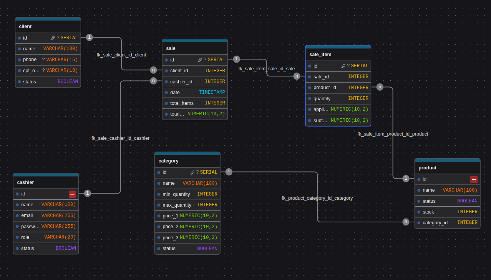

# 📘 Documentação – Picolynne Store

## 📌 Sumário

* [Introdução](#introdução)
* [Tecnologias Utilizadas](#tecnologias-utilizadas)
* [Regra de Negócio – Faixa de Preços](#regra-de-negócio--faixa-de-preços)
* [Tipo de Banco de Dados](#tipo-de-banco-de-dados)
* [Estrutura do Banco de Dados](#estrutura-do-banco-de-dados)
  * [client](#client)
  * [cashier](#cashier)
  * [category](#category)
  * [product](#product)
  * [sale](#sale)
  * [sale_item](#sale_item)
* [Relacionamentos](#relacionamentos)
* [Diagrama do Banco de Dados](#diagrama-do-banco-de-dados)
* [Liceça](#liceca)

---

## 🧊 Introdução

O **Picolynne Store** é um sistema de vendas automatizado para picolés, desenvolvido para operar em **caixas (PDV)**, com suporte a **clientes cadastrados ou cliente padrão**, controle de **estoque**, e uma **regra de preço dinâmica baseada na quantidade total de itens vendidos por categoria**.

O sistema foi projetado para funcionar em **Desktop e Mobile**, com backend em **Python**, frontend em **JavaScript**, e banco de dados **PostgreSQL**.

---

## 🛠️ Tecnologias Utilizadas

- PostgreSQL
- Python (backend)
- JavaScript (frontend)
- DrawDB (modelagem do banco)

---

## 🧠 Regra de Negócio – Faixa de Preços

A regra de preço funciona da seguinte forma:

Para cada **categoria**:

* 🔹 **Preço 1** → aplicado quando a quantidade total de produtos da categoria no carrinho é **menor que `min_quantity`**
* 🔹 **Preço 2** → aplicado quando a quantidade é **maior ou igual a `min_quantity` e menor que `max_quantity`**
* 🔹 **Preço 3** → aplicado quando a quantidade é **maior ou igual a `max_quantity`**

📌 Essa lógica é calculada **antes de salvar a venda**, e o valor final aplicado é armazenado em `sale_item.applied_unit_price`.

---

## 🗄️ Tipo de Banco de Dados

* **Sistema de Banco de Dados:** PostgreSQL
* **Modelo:** Relacional
* **Foco:** Integridade de dados, histórico de vendas e performance para PDV

---

## 🧱 Estrutura do Banco de Dados

### 🧍 client

Armazena os clientes cadastrados. Caso o cliente não esteja cadastrado, o sistema pode utilizar um **cliente padrão**.

| Campo       | Tipo         | Restrições   | Descrição                |
| ----------- | ------------ | ------------ | ------------------------ |
| id          | SERIAL       | PK           | Identificador do cliente |
| name        | VARCHAR(100) | NOT NULL     | Nome do cliente          |
| phone       | VARCHAR(15)  |              | Telefone                 |
| cpf_or_cnpj | VARCHAR(18)  | UNIQUE       | CPF ou CNPJ              |
| status      | BOOLEAN      | DEFAULT true | Cliente ativo ou inativo |

---

### 🧑‍💼 cashier/user

Representa o caixa responsável pela venda (usuário do sistema).

| Campo    | Tipo         | Restrições   | Descrição                      |
| -------- | ------------ | ------------ | ------------------------------ |
| id       | SERIAL       | PK           | Identificador do caixa         |
| name     | VARCHAR(100) | NOT NULL     | Nome ou identificação do caixa |
| email    | VARCHAR(255) | UNIQUE       | Email de acesso                |
| password | VARCHAR(255) | NOT NULL     | Senha criptografada            |
| status   | BOOLEAN      | DEFAULT true | Caixa ativo                    |

---

### 🧊 category

A **categoria é a entidade central da regra de preços**.
Ela define **quantidades mínimas e máximas** e **3 faixas de preço** aplicadas conforme a quantidade total de produtos da mesma categoria no carrinho.

| Campo        | Tipo          | Restrições   | Descrição                   |
| ------------ | ------------- | ------------ | --------------------------- |
| id           | SERIAL        | PK           | Identificador da categoria  |
| name         | VARCHAR(100)  | NOT NULL     | Nome da categoria           |
| min_quantity | INTEGER       | NOT NULL     | Quantidade mínima           |
| max_quantity | INTEGER       | NOT NULL     | Quantidade máxima           |
| price_1      | NUMERIC(10,2) | NOT NULL     | Preço abaixo da mínima      |
| price_2      | NUMERIC(10,2) | NOT NULL     | Preço entre mínima e máxima |
| price_3      | NUMERIC(10,2) | NOT NULL     | Preço acima da máxima       |
| status       | BOOLEAN       | DEFAULT true | Categoria ativa             |

---

### 🍦 product

Os produtos **não possuem preço próprio**.
O preço sempre vem da **categoria** à qual o produto pertence.

| Campo       | Tipo         | Restrições   | Descrição                |
| ----------- | ------------ | ------------ | ------------------------ |
| id          | SERIAL       | PK           | Identificador do produto |
| name        | VARCHAR(100) | NOT NULL     | Nome do produto          |
| status      | BOOLEAN      | DEFAULT true | Produto ativo            |
| stock       | INTEGER      | DEFAULT 0    | Quantidade em estoque    |
| category_id | INTEGER      | FK           | Categoria do produto     |

**Índices**

* `idx_product_category (category_id)`

---

### 🧾 sale

Representa uma venda realizada no caixa.

| Campo       | Tipo          | Restrições    | Descrição              |
| ----------- | ------------- | ------------- | ---------------------- |
| id          | SERIAL        | PK            | Identificador da venda |
| client_id   | INTEGER       | FK            | Cliente da venda       |
| cashier_id  | INTEGER       | FK            | Caixa responsável      |
| date        | TIMESTAMP     | DEFAULT NOW() | Data da venda          |
| total_items | INTEGER       | NOT NULL      | Total de itens         |
| total_price | NUMERIC(10,2) | NOT NULL      | Valor total            |

**Índices**

* `idx_sale_date`
* `idx_sale_cashier`
* `idx_sale_client`

---

### 🛒 sale_item

Itens individuais da venda.
Aqui fica armazenado o **preço aplicado no momento da venda**, garantindo histórico mesmo que a categoria mude no futuro.

| Campo              | Tipo          | Restrições | Descrição               |
| ------------------ | ------------- | ---------- | ----------------------- |
| id                 | SERIAL        | PK         | Identificador           |
| sale_id            | INTEGER       | FK         | Venda                   |
| product_id         | INTEGER       | FK         | Produto                 |
| quantity           | INTEGER       | NOT NULL   | Quantidade              |
| applied_unit_price | NUMERIC(10,2) | NOT NULL   | Preço unitário aplicado |
| subtotal           | NUMERIC(10,2) | NOT NULL   | quantity × price        |

---

## 🔗 Relacionamentos

* **product → category**: muitos para um
* **sale → client**: muitos para um
* **sale → cashier**: muitos para um
* **sale_item → sale**: muitos para um
* **sale_item → product**: muitos para um

---

## 🗺️ Diagrama do Banco de Dados

> Diagrama ER gerado no **drawdb** com base no schema SQL final:

---

## 📄 Licença

Este projeto está licenciado sob a **Apache License 2.0**.  
Veja o arquivo [LICENSE](LICENSE) para mais detalhes.
